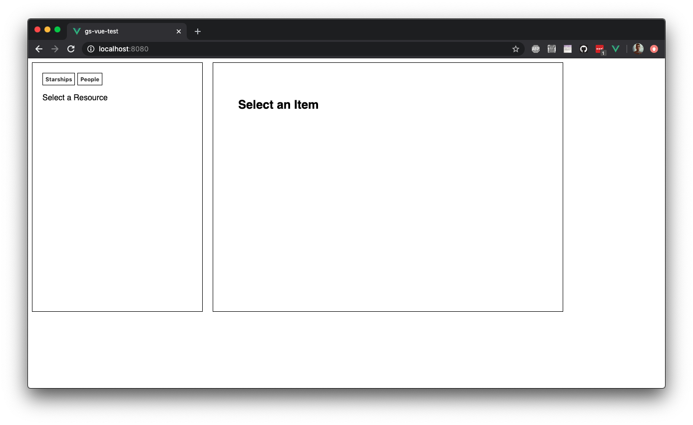
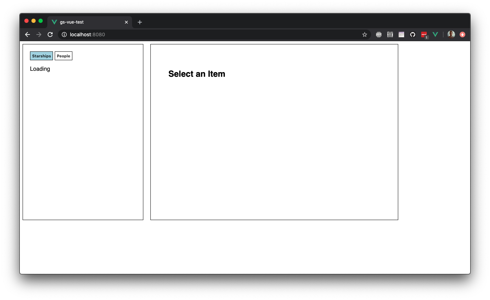
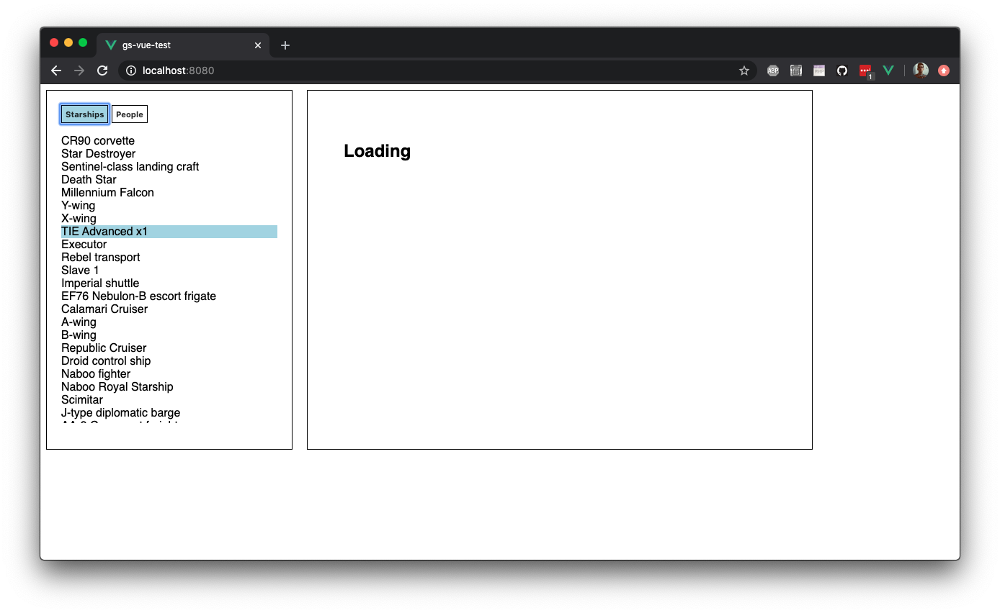

# PAPER Vue Assessment

The requirements of the test are outlined below, as well as a set of design mockups and steps to get started in the development environment. Please fork this repository and complete the test in a repository of your own.

This coding test will use the following routes from the [Star Wars API](https://swapi.dev/):
- [Starships](https://swapi.dev/documentation#starships)
- [People](https://swapi.dev/documentation#people)

## Pre-requirements
Node and either NPM(suggested) or Yarn must be installed on your computer, as well as Git.

## Evaluation Criteria
You will be evaluated on the following:
1. Readability of your code
2. Code organization
3. Problem solving skills
4. How well the guidelines provided were followed
5. If the code runs without errors

## Instructions
1. Once the repo is pulled in, create a new branch off master and name it tests/[first_name-last_name]. This is where you will be implementing your solutions to the questions.
2. Read through the app requirements
3. You may create as many folders and files as necessary, but you **MUST NOT** remove, rename or reorganize pre-existing files and folders.
4. Once you are done, commit your changes and push the branch to the remote repository.

## Requirements
- As a user, I can click buttons labelled "starships" and "people" in the left sidebar and receive a full list of the names of all the items from that resource
- The buttons for each resource have a "selected" state which is enabled when the resource is being shown
- As a user, when I click on a specific item name, 
I see a list of information about that item in the main area
- the item in the sidebar should also have a selected state which is enabled when the item details are shown in the main area
- the main area should have a title with the name of the item
- If the item is a starship, I see the following details:
    - model
    - manufacturer
    - starship class
- If the item is a person, I see:
    - eye color
    - birth year
- The app should be styled similarly to the mockups below

## Mockups
Empty State


Loading Sidebar State


Loading Item State


Filled State

### Project setup
```
npm install
```

#### Compiles and hot-reloads for development
```
npm run serve
```
